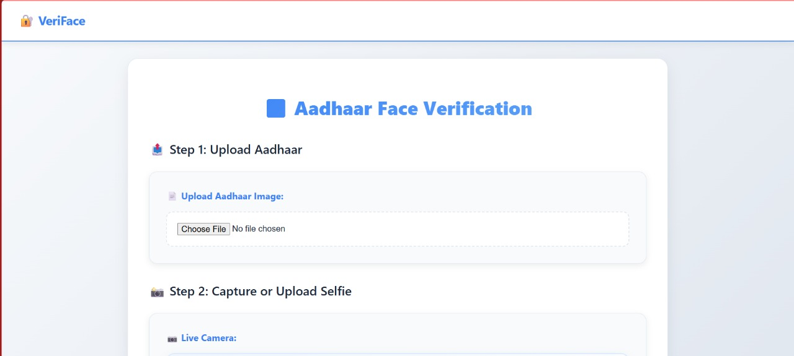
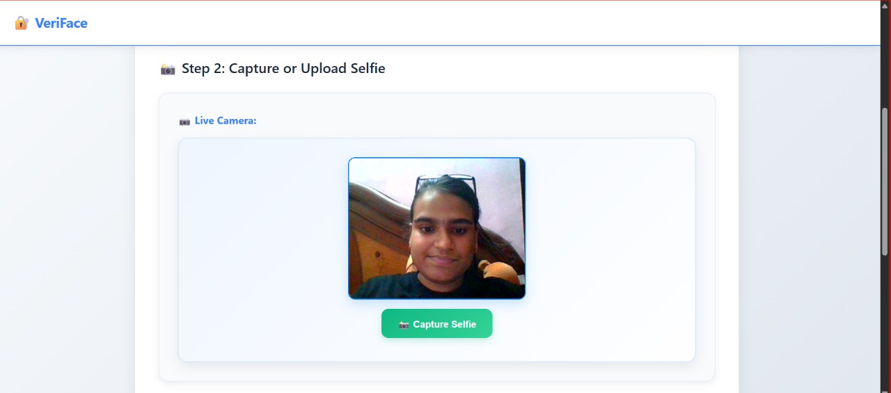
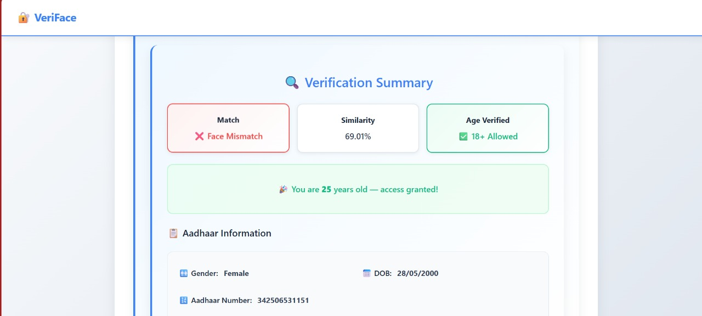
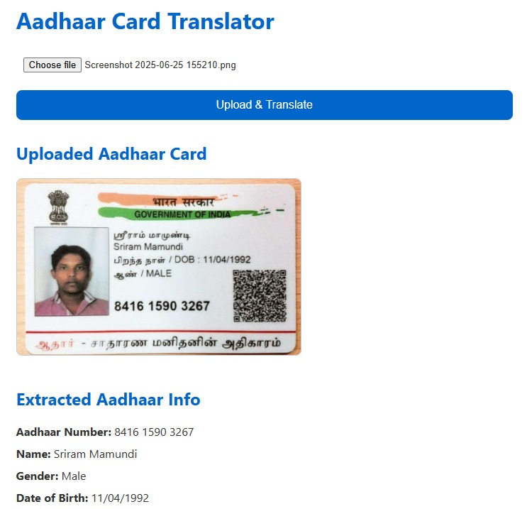

---

---

# 🔐 VeriFace — Aadhaar + Face + Age Verification App

**Team Alpha Coders | Zynga Hackathon 2025**

**Team Members:** Akshita Goel, Aarushi Singh, Chanda Jha, Mayuri Paliwal, Monika Rana

Real-time face match and age verification using Aadhaar + Selfie. Built with ❤️ using the **MERN stack** + **Python AI backend**.

---
---

## 📽️ Demo Video

🎥 Click to watch VeriFace in action:  
[](https://www.youtube.com/watch?v=QztANWQiN8U)


---
## 🗂️ Project Resources

All key materials — including our pitch deck, documentation, and demo video — are available in the shared Drive folder:

🔗 **[📁 Google Drive: VeriFace Assets](https://drive.google.com/drive/folders/1rOUPM85Hm6vniYlbGFKGuyLIAeotO0RX)**


## 🧠 Overview

VeriFace checks if a person is:

* ✅ **18+** (based on Aadhaar DOB)
* ✅ **Same person** (via face match with selfie)
* ✅ **Using a valid Aadhaar card**

**Key Features:**

* 🔍 Real-time OCR + face comparison
* 🔄 Live progress with Server-Sent Events (SSE)
* 🎥 React UI with webcam integration
* 🧠 AI-powered backend (PyTorch + Python + Node)


Contents:
- 📄 Project Report (DOCX)
- 📊 Final PPT Presentation
- 🎥 Demo Video (HD)
- 🖼️ Screenshots & UI Assets

## 🖼️ UI Walkthrough — Step-by-Step

### 🪪 Step 1: Upload Aadhaar



### 📸 Step 2: Capture or Upload Selfie



### ⏳ Step 3: Live Verification Progress

SSE-powered updates showing OCR, embedding & similarity processing


### ✅ Step 4: Click Verify and View Results



---
---

## 🌐 Multilingual Aadhaar Support

Many Aadhaar cards include text in Hindi or other regional languages. Our OCR pipeline handles this seamlessly:

- 🧾 Detects and extracts info even when text is in **Devanagari script** (like Hindi)
- 🌐 Uses **Tesseract language packs** and smart regex logic
- 🔄 Translates / normalizes extracted text to English for further processing

📸 **Example:**
> Aadhaar name in Hindi (`आरुषि सिंह`) → Parsed as `Aarushi Singh`  
> Gender `महिला` → Recognized as `Female`  
> DOB in any script → Extracted as `15/08/2004`

✅ This makes **VeriFace** robust across diverse Aadhaar formats used across India.


> OCR working on Tamil Aadhaar card with successful translation + extraction
---

## 💡 Smart Feedback on Selfie Quality

To ensure accurate face verification, **VeriFace** gives live feedback on selfie clarity and lighting conditions:

- 🔆 Warns if selfie is **too dark or overexposed**
- 📏 Rejects blurry images (uses Laplacian-based blur detection)
- 📸 Prompts user to retake selfie for best results

✅ This ensures we only process **high-quality face images** for accurate comparison.

## 🧑‍💻 Tech Stack

| Layer         | Tech Stack                                         |
| ------------- | -------------------------------------------------- |
| **Frontend**  | React.js, React Webcam, Toastify                   |
| **Backend**   | Node.js, Express, Multer, Server-Sent Events (SSE) |
| **Python AI** | Tesseract, FaceNet (InceptionResNet), MTCNN        |
| **Database**  | None (stateless demo)                              |
| **Libs**      | facenet-pytorch, OpenCV, SciPy, NumPy              |

---

## 🚀 Getting Started

### 1. Clone the Repo

```bash
git clone https://github.com/your-team/VeriFace.git
cd VeriFace
```

### 2. Install Frontend

```bash
cd client
npm install
npm start
```

### 3. Install Backend

```bash
cd ../server
npm install
```

### 4. Setup Python Scripts

```bash
cd scripts
pip install -r requirements.txt
```

---

## 📷 React Frontend Highlights

* 🔴 Live webcam preview + capture
* 🪪 Aadhaar image upload
* ⚡ Realtime progress via SSE
* ✅ Result cards with age + match score

---

## 🧠 Express Backend API

### `POST /api/users/upload`

**Uploads Aadhaar + Selfie**

**Response:**

```json
{
  "aadhaarPath": "...",
  "selfiePath": "..."
}
```

---

### `GET /api/users/verify-face-sse?aadhaarPath=...&selfiePath=...`

**Streams live verification progress**

**Response Stream:**

```json
data: { "percent": 60, "msg": "📸 Processing Selfie..." }
data: { "done": true, "result": { ... } }
```

---

## 🧠 Python Scripts

### 📝 `extract_info.py` — OCR Aadhaar Info

Extracts:

* Name
* DOB
* Gender
* Aadhaar number
* Age (from DOB)

**Sample Output:**

```json
{
  "name": "Aarushi Singh",
  "dob": "15/08/2004",
  "gender": "Female",
  "aadhaar_number": "123456789012",
  "age": 20
}
```

---

### 🧬 `get_embedding.py` — Face Embedding

* MTCNN → face detection
* InceptionResNet → 512-d embeddings
* Sliced to 128-d for demo
* Saves cropped face image

```python
if emb.size == 512:
    emb = emb[:128]
```

**Sample Output:**

```json
{
  "embedding": [0.02, -0.03, ...],
  "cropped_face": "aadhaar_face.jpg"
}
```

---

### 🧠 `compare_embeddings.py` — Face Match

* Loads Aadhaar + selfie embeddings
* Cosine similarity ≥ 70% → match

**Sample Output:**

```json
{
  "match": true,
  "similarity": 82.45
}
```

---

## 🔁 Alternate Blocking API (No SSE)

### `POST /api/users/verify`

**FormData:** `aadhaar`, `selfie`

**Output:**

```json
{
  "face_match": true,
  "similarity": "83.92%",
  "age_verified": true,
  "aadhaar_info": { ... }
}
```

---

## 🧪 JS-only OCR API (Fallback)

### `POST /api/utils/extract-dob`

**Output:**

```json
{
  "dob": "15/08/2004",
  "age": 20,
  "isAdult": true
}
```

---
## 📦 Dependencies

### React (Frontend)
- react, react-dom, react-webcam, react-toastify

### Node.js (Backend)
- express, multer, cors

### Python (AI Scripts)
- facenet-pytorch, MTCNN, torch, numpy, scipy
- opencv-python, tesserocr, pillow

## 🏁 What We Achieved

* ✅ Full offline AI pipeline
* ✅ Real-time updates via SSE
* ✅ Face match + age verification
* ✅ Clean & responsive UI
* ✅ End-to-end working hackathon demo

---
